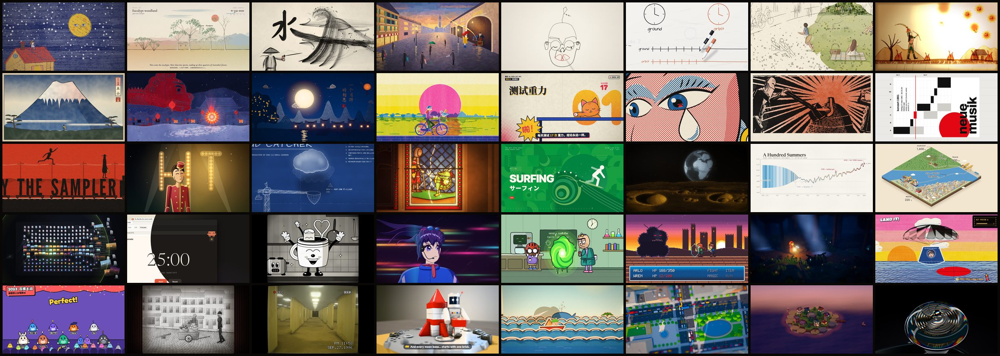

# Lemo-Opuscar

**40 film styles, each with a short film made entirely in code.** Pick a style, bring your own topic, and let your coding agent direct the film.

[**▶ Watch the gallery**](https://lemomo-ai.github.io/lemo-opuscar/) · [中文说明](README.zh-CN.md)



Every film here was directed, drawn, scored and mixed by an AI agent (Claude Opus 5.5) writing code: canvas and WebGL pages rendered frame by frame, original music from free sample libraries, local text-to-speech. No video generation, no stock footage.

## How to use it

```sh
git clone https://github.com/lemomo-ai/lemo-opuscar.git
cd lemo-opuscar
claude            # or Codex, Cursor… any agent that reads AGENTS.md
```

Then just ask:

> Make a 45-second film in the **watercolor** style about the coffee farm my family runs. Warm female narrator.

The agent reads three guides and works like a small studio:

| File | What it gives the agent |
|---|---|
| [`DIRECTOR.md`](DIRECTOR.md) | how to direct: story, sound, rhythm, camera, performance, self-checks |
| [`TECHNIQUE.md`](TECHNIQUE.md) | how to build: frame-by-frame rendering, voice, music, mixing |
| `styles/<style>/STYLE.md` | what this style looks and sounds like, and how our demo was made |

It stops twice for you: once to approve the **story and storyboard**, once to approve the **look**. Then it produces the film into `films/<name>/`.

Prefer to work in your own project? Point your agent at those three files instead.

**Good to know:** a film takes an agent roughly 30–60 minutes of work, so it uses a fair amount of tokens. You'll need Node 20+, Chrome, ffmpeg and Python 3.11+. Big assets (voice model, sample libraries) download only when a step needs them.

## The styles

<!-- styles:start -->

**Hand-drawn & Painting**

- [Crayon Picture Book](styles/crayon-book/STYLE.md) · *The Moon Can't Sleep*: The moon can't sleep, so a little girl climbs onto the roof to sing it a lullaby.
- [Watercolor Brush](styles/watercolor/STYLE.md) · *Follow the Rain*: Follow the rain from Australia's red desert heart to its green coast in one unbroken painted walk.
- [Chinese Ink Wash](styles/ink-wash/STYLE.md) · *The Swordsman and the River*: A swordsman crosses the river on the water and splits the current with a single stroke.
- [Impasto Oil Painting](styles/impasto/STYLE.md) · *The Colour of Rain*: In a grey, rainy square one red umbrella opens, and a waltz paints the whole plaza in colour.
- [One-line Drawing](styles/one-line/STYLE.md) · *The Line That Never Lifted*: One unbroken line draws a whole life, then the pen passes to a child.
- [Whiteboard Explainer](styles/whiteboard/STYLE.md) · *Einstein in Your Pocket*: How your phone knows where you are: GPS, atomic clocks, and the 38 microseconds relativity adds every day.
- [Urban Sketch · Pen & Wash](styles/urban-sketch/STYLE.md) · *Where the Wind Went*: A park that is only a pen sketch; wherever the wind carries her straw hat, colour follows.

**East Asian Traditions**

- [Shadow Puppetry](styles/shadow-puppet/STYLE.md) · *Hou Yi Shoots the Suns*: Ten suns scorch the earth until the archer Hou Yi draws his bow, told with leather puppets on a lit screen.
- [Ukiyo-e](styles/ukiyoe/STYLE.md) · *A Journey Toward the Mountain*: A traveller walks toward a distant mountain; every shot is a woodblock print, ending in a great wave.
- [Red Paper-cut](styles/papercut-red/STYLE.md) · *Nian Comes to Town*: On New Year's Eve the beast Nian comes to town, and one girl's giant paper-cut lights up the village to scare it off.
- [Paper-cut Lightbox](styles/paper-lantern/STYLE.md) · *A Mooncake's Longing*: A single mooncake tells the Mid-Autumn story of reunion and longing inside a glowing paper-cut lightbox.

**Print & Printmaking**

- [Risograph Print](styles/risograph/STYLE.md) · *Sunday Ride*: A Sunday-morning bike ride through the city — bakery, park, riverside — in two misregistered inks.
- [Halftone Dossier](styles/halftone-dossier/STYLE.md) · *Case File: Chubby*: A chubby orange cat stands trial for testing gravity and 4 a.m. parkour, and walks free.
- [Woodcut Print](styles/woodcut/STYLE.md) · *The Bell Founder*: A village spends a whole winter casting one bell; the first time it rings, the snow stops.

**Graphic & Type**

- [Swiss Motion Graphics](styles/swiss-motion/STYLE.md) · *Five Rules for a Poster*: A concert poster lays itself out by five Swiss design rules; the fifth is to break just one.
- [60s Spy Title Sequence](styles/spy-titles/STYLE.md) · *The Velvet Cipher*: Opening titles for an imaginary 1964 spy film: a chase for a stolen key until the shapes lock into the title.
- [Art Deco](styles/art-deco/STYLE.md) · *Midnight at the Starlight Hotel*: A grand hotel, 1930: a bellboy races lifts and revolving doors to deliver one letter before midnight.
- [Blueprint](styles/blueprint/STYLE.md) · *Patent Pending: The Cloud Catcher*: An inventor's blueprint draws, explodes and assembles a cloud-catching machine, and its revision cloud starts to rain.
- [Stained Glass](styles/stained-glass/STYLE.md) · *The Dragon of the East Window*: Sunlight crosses a cathedral window from dawn to dusk, waking each pane of a knight-and-dragon tale.
- [Pictogram Motion](styles/pictogram-motion/STYLE.md) · *Aichi-Nagoya 2026 — All 43 Sports*: All 43 sports of the 2026 Asian Games as beat-locked geometric pictograms.
- [ASCII / CRT Terminal](styles/ascii-crt/STYLE.md) · *Tranquility.log*: A moon-base AI wakes after forty years to a signal from Earth, and replies by drawing “home” in characters.

**Information & Keynote**

- [Data Storytelling](styles/dataviz/STYLE.md) · *A Hundred Summers*: A hundred years of summer temperatures, where the chart itself tells the story.
- [Isometric Infographic](styles/iso-infographic/STYLE.md) · *From Bean to Cup*: A coffee's journey from the plantation to your hands, across one isometric world.
- [Dark Tech Keynote](styles/dark-keynote/STYLE.md) · *Room to Think*: Launch film for Tidy, a fictional app: one buried cursor snaps hundreds of windows back into place.
- [Living Screencast](styles/living-screencast/STYLE.md) · *Clawd Moves In*: Clawd, the Claude Code pixel mascot, hops out of the terminal into the Claude app and acts out plan mode, diff comments and self-checks in a one-take screencast.

**Cartoon & Anime**

- [1930s Rubber Hose Cartoon](styles/rubber-hose/STYLE.md) · *Coffee Cup Chase*: A coffee cup chases a runaway sugar cube around the kitchen, 1930s-cartoon style.
- [80s Cel Anime](styles/cel-anime-80s/STYLE.md) · *City Lights, 1987*: A courier girl rides through a rain-soaked neon city to deliver a tape before the dawn launch.
- [Sci-Fi Sitcom Toon](styles/scifi-toon/STYLE.md) · *Coffee Run*: A jaded genius opens a portal just to buy coffee and tumbles through ever-stranger universes.

**Games**

- [16-bit Pixel RPG](styles/pixel-rpg/STYLE.md) · *The Last Save Point*: At the final boss door a hero saves the game, and the save screen replays the whole journey.
- [HD-2D](styles/hd-2d/STYLE.md) · *The Lampbearer*: The lighthouse goes dark; a girl carries the last flame through a night forest and up the storm cliffs.
- [Microgame Frenzy](styles/microgame/STYLE.md) · *Five-Second Astronaut*: A clumsy cadet survives a five-second boot camp, faster and faster, until the boss: landing home.
- [Game Show Flat](styles/game-show/STYLE.md) · *Rhythm of AI, 1997 → 2026*: The history of AI as a rhythm game: models take the stage on the beat, and a report card closes the show.

**Cinema & Eras**

- [1920s Silent Film](styles/silent-film/STYLE.md) · *The Runaway Loaf*: A baker's boy chases a runaway loaf downhill, then breaks it in half for a hungry girl.
- [Liminal Found Footage](styles/backrooms/STYLE.md) · *Night Shift Orientation*: A new night-shift hire films their first night in an endless yellow office, following the rules on the wall.

**Materials & 3D**

- [Brick Toy](styles/brick-toy/STYLE.md) · *Rocket from Spare Parts*: A brick astronaut builds a rocket from spare parts and flies to a brick moon.
- [Paper Pop-up Book](styles/paper-popup/STYLE.md) · *Pip's Paper Adventure*: A pop-up book opens on a desk; a sprite named Pip adventures through paper worlds and jumps out into ours.
- [Tilt-Shift Miniature](styles/tilt-shift/STYLE.md) · *Toy Town Rush Hour*: Morning rush hour in a town that looks like a model: traffic, trains and tiny people.
- [Low-poly Isometric Island](styles/lowpoly-island/STYLE.md) · *The Island That Grew*: An island and its village grow tile by tile from an empty sea, each tile a note, into a starry night.
- [Glass Product Render](styles/glass-product/STYLE.md) · *Aura — Hear the Light*: Unboxing and close-ups of Aura, fictional glass earbuds, in strip-light sweeps and caustics.
<!-- styles:end -->

## Credits and licence

Made by **LemoLab × Claude Opus 5.5**. Code is MIT; the guides, `STYLE.md` files and films are CC BY 4.0. Third-party samples, fonts and music keep their own licences (CC0, CC BY, OFL) and are listed in each demo's `CREDITS`.
